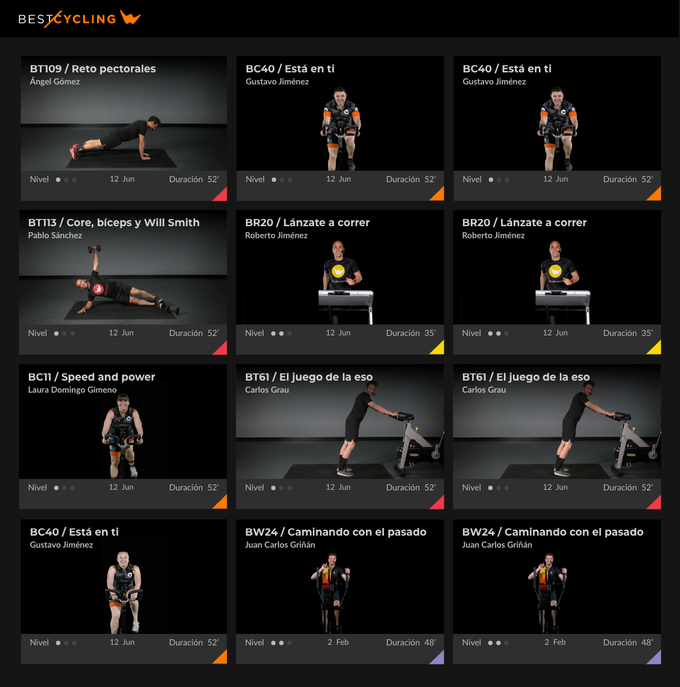
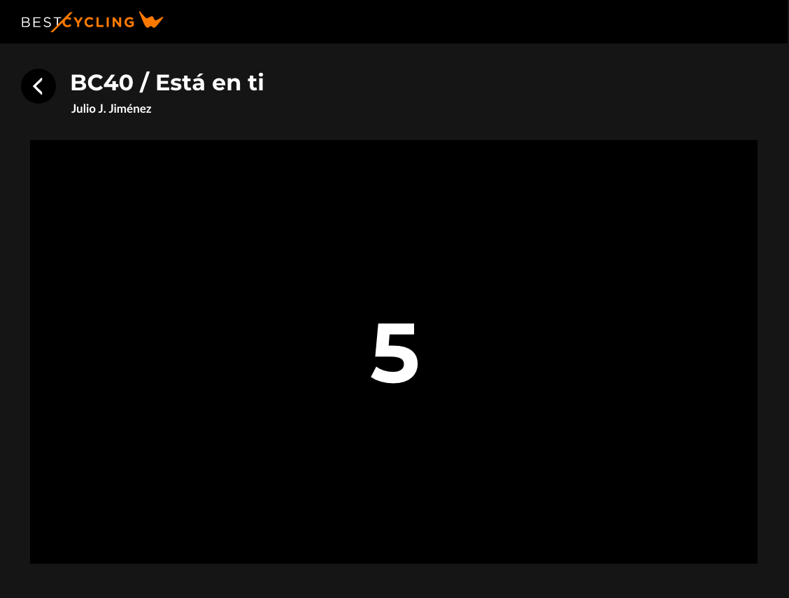
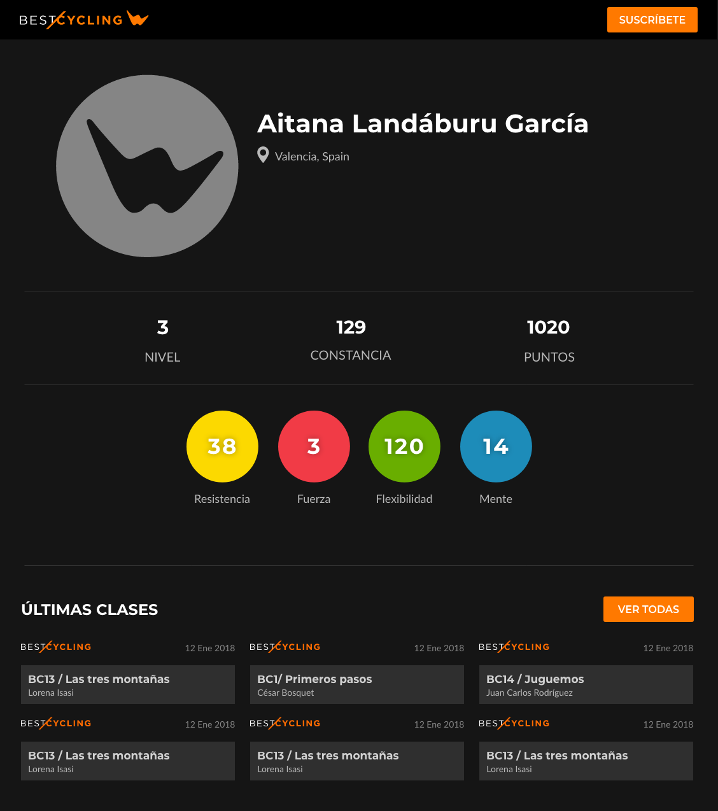
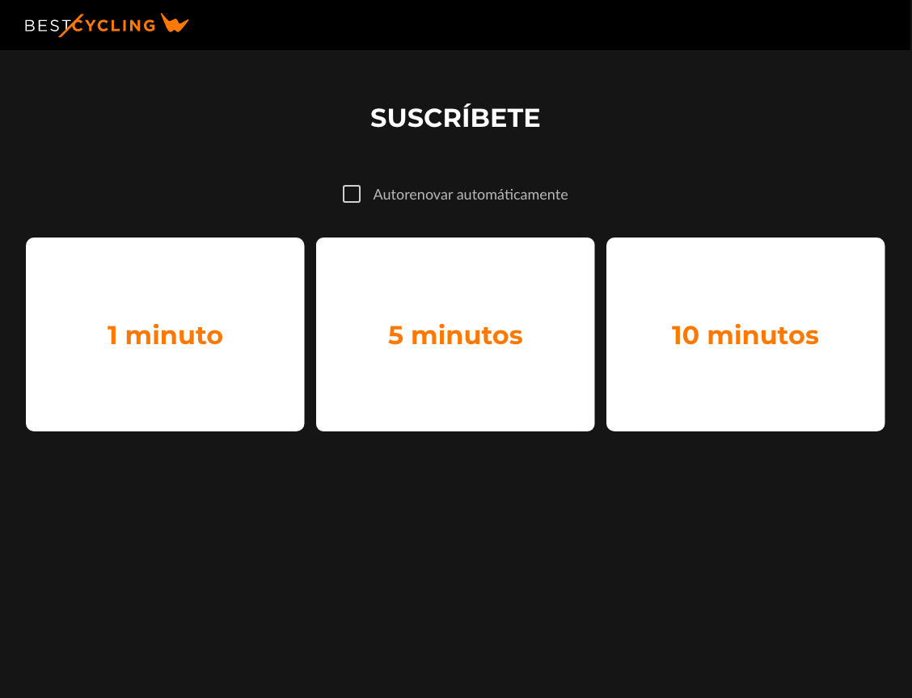
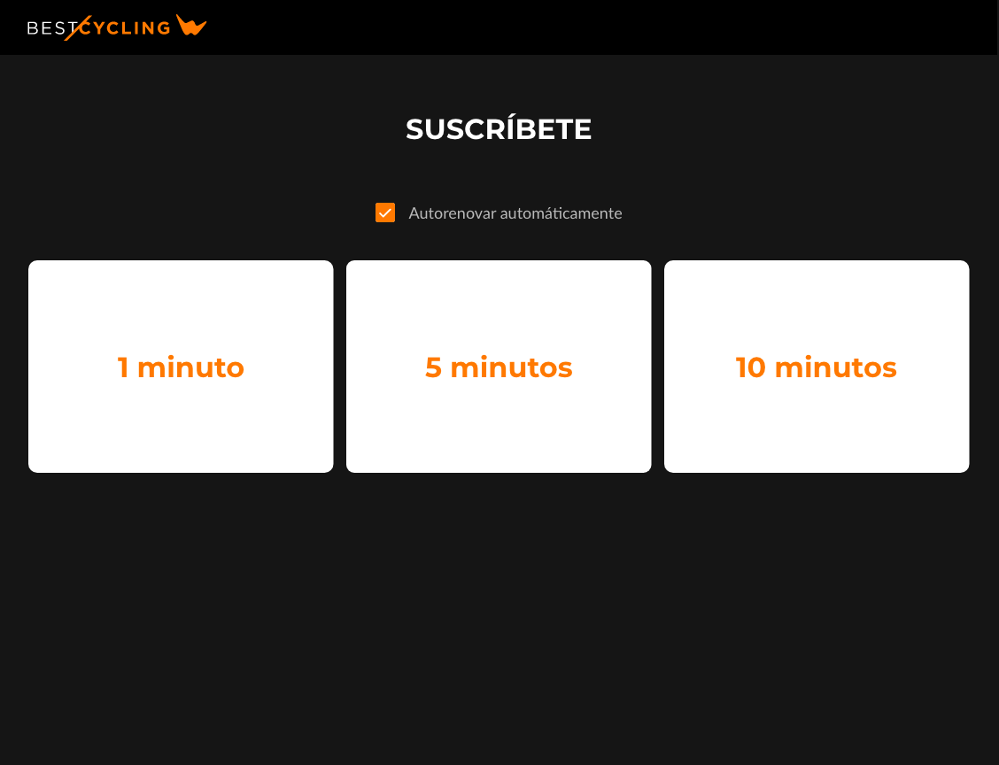

# Prueba técnica de React

- [Prueba técnica de React](#prueba-técnica-de-react)
  - [Introducción](#introducción)
  - [Ejercicio Nivel 1: Interfaz y navegación](#ejercicio-nivel-1-interfaz-y-navegación)
  - [Ejercicio Nivel 2: Reproductor.](#ejercicio-nivel-2-reproductor)
  - [Ejercicio Nivel 3. Suscripción al servicio.](#ejercicio-nivel-3-suscripción-al-servicio)

## Introducción

Esta prueba técnica se divide en 3 ejercicios de creciente dificultad. Cada ejercicio depende del anterior, por lo que hay que hacerlos en orden.

Deben implementarse en React y se puede usar cualquier librería/framework que se necesite (create-react-app, nextjs, librerias de routing, estado, etc...).

Debe crearse un proyecto en git vacío y crear una rama independiente para cada ejercicio partiendo desde el ejercicio anterior.

Por ejemplo:

     | - master
         |- ejercicios/ejercicio1
            |- ejercicios/ejercicio2
               |- ejercicios/ejercicio3

De esta forma, la rama `ejercicios/ejercicios1` se creará a partir de `master`, la rama `ejercicios/ejercicio2` se creará a partir de la rama `ejercicios/ejercicio1` y la rama `ejercicios/ejercicio3` se creará a partir de la rama `ejercicios/ejercicio2`.

---

## Ejercicio Nivel 1: Interfaz y navegación

Desarrollo de front de las páginas _Inicio_, _Listado de Clases_ y _Reproductor_ obteniendo varios datos desde el API, y navegación entre todas las pantallas.

El API está disponible aquí: https://bestcycling-public.s3.eu-west-1.amazonaws.com/api-test/db.json.

Requisitos:

- Implementar Pantalla de Inicio lo más similar posible a la siguiente imagen:

Debe mostrar las últimas 9 clases que devuelva el API.
Al hacer click en una clase se accede al reproductor de la clase.
Al hacer click en "Ver todas" se accede al listado de clases.

- Implementar Pantalla de Listado de clases.

  

Debe mostrar todas las clases que devuelva el API.
Al hacer click en una clase se accede al reproductor de la clase.

- Implementar Pantalla de reproducción

  

Esta apágina debe mostrar el título, nombre del instructor y el botón de volver a la página anterior.

---

## Ejercicio Nivel 2: Reproductor.

Este ejercicio consiste en desarrollar un reproductor ficticio para poder "reproducir" las clases. También se debe modificar el listado para permitir seleccionar clases y reproducirlas de forma automática.

Requisitos:

- El reproductor ficticio consistirá en un contador decreciente de 5 segundos como en la siguiente imagen:

  

  Cuando la cuenta llegue a 0 debe volver a la página anterior automáticamente.

  Se debe poder salir del reproductor en cualquier momento sin tener que esperar a que la cuenta llege a 0.

  Sólo si la reproducción de una clase finaliza, es decir, la cuenta atrás llega a 0, debe marcarse la clase ha sido realizada.

- El listado debe modificarse para incluir un checkbox de selección para poder selecionar una o varias clases:

  

- Si se selecciona una clase aparecerá el botón de "Iniciar reproducción" automáticamente.

  

  Si el usuario selecciona n clases deben reproducirse una tras otra, actualizando el título y el instructor de cada clase.

- En el listado debe aparecer la etiqueta en las clases que han sido realizadas, es decir, las clases que se han reproducido totalmente.

  

---

## Ejercicio Nivel 3. Suscripción al servicio.

Este ejercicio consiste en diseñar e implementar un sencillo sistema de suscripción. Para ello es necesario implementar una pequeña API que cree y valide las suscripciones.

No es necesario persistir los datos al finalizar el proceso de API.

Para simplificarlo todo, supongamos que las llamadas las hace el usuario con ID: 1 y que no es necesario enviar tokens ni validar nada, pero hay que tener en cuenta que en el futuro sí que podrían haber más usuarios.

Requisitos:

- Debe añadirse en el layout el estado de la suscripción.

  

- Debe implementarse la página de suscripción. Los planes disponibles son la suscripción de 1, 5 y 10 minutos.

  

  Se debe añadir un checkbox en la página de suscripción para simular renovaciones automáticas.

- Debe diseñarse e implementarse el endpoint en el API que almacene información sobre el estado de la suscripción. (Debe controlarse que un usuario no pueda suscribirse más de una vez si hay una suscripción activa.

- Si el usuario está suscrito debe aparecer el tiempo de suscripción restante en el layout. Al llegar a 0 debe cambiar el estado a "Suscribirse" o "Renovación pendiente" en caso de que el usuario haya marcado la autorenovación)

  

- La página de suscripción debe indicar el estado de la suscripción en caso de estar suscrito y cambiar la opción de autorenovación.

  

- El acceso al reproductor sólo está diponible a los usuarios suscritos con suscripción activa.

Por tanto, al acceder al reproductor se pueden dar los siguientes casos:

1. El usuario está suscrito:
   Se iniciará la reproducción normalmente.

2. El usuario no esta suscrito.
   Se redijirá al usuario a la página de suscripción.

3. El usuario ha finalizado la suscripción pero tiene la opción de autorenovar activa.
   Se renovará la suscripción durante el periodo indicado por el usuario y se mostrará el reproductor.

- Por último, puede pasar que el usuario seleccione una lista de n clases para reproducir y su suscripción finalize mientras las está reproduciendo. En este caso al finalizar la clase actual debe aplicarse la lógica anterior de control de la suscripción.
